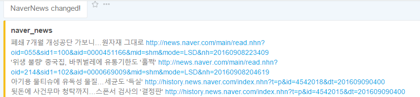

### 네이버뉴스크롤러 & Jandi 웹훅

####기능요구사항
네이버 뉴스를 1시간마다 확인 하여 새로운 뉴스가 확인 될 경우 메세지플랫폼(**Jandi)에 알림(웹훅)을 보내는 크롤러를 제작하려 합니다.
* 수집
    * [여기](http://news.naver.com/main/history/mainnews/index.nhn?date=2016-08-30&time=02:00)에서 뉴스 수집을 진행합니다.
    * 수집되는 시간은 매 한시간마다 작동됩니다.
    * 처음 작동을 시작하였을때 뉴스의 정보들을 가지고 있다가 1시간 뒤에 확인을 하고 달라진 부분을 확인할 수 있어야 합니다.
    * 변경을 확인해야하는 부분은 뉴스의 기사 제목들을 기준으로 합니다.
* 전송
    * 메세지 전송은 Jandi를 이용하여 진행합니다.
    * Jandi 의 메세지 전송은 [http://goo.gl/a0geJ1](http://goo.gl/a0geJ1) 공식 사이트를 참조하시기 바랍니다.
* 웹훅(Webhook)
    * 웹훅(Webhook)이란 Jandi에 Jandi가 정한 포맷에 일치하는 데이터를 수신하여 지정된 대화에 메시지 형태로 전송해주는 기능을 말합니다.

####알림 화면 예시
\* Jandi
>naver_news

>폐쇄 7개월 개성공단 가보니…원자재 그대로 >http://news.naver.com/main/read.nhn?oid=055&sid1=100&aid=0000451166&mid=shm&mode=LSD&nh=20160908223409

>'위생 불량' 중국집, 바퀴벌레에 유통기한도 '훌쩍' >http://news.naver.com/main/read.nhn?oid=214&sid1=102&aid=0000669009&mid=shm&mode=LSD&nh=20160908204619 
>
> ...

### Manual
#### 실습 환경
* Server: Windows 10 (Intel PC)
* Language: Python 3.5.2
* Tool: Sublime Text3, SourceTree(GIT GUI)
* pip install list: Beautiful Soup 4.5.1

#### 실행 방법
> python NaverNewsCrawler.py

#### Program Logic
Beautiful Soup을 통해 설정해놓은 네이버 메인 뉴스를 크롤링하여 데이터를 반환.
반환받은 뉴스 데이터를 Jandi 웹훅 주소로 HTTP POST request 전송.

